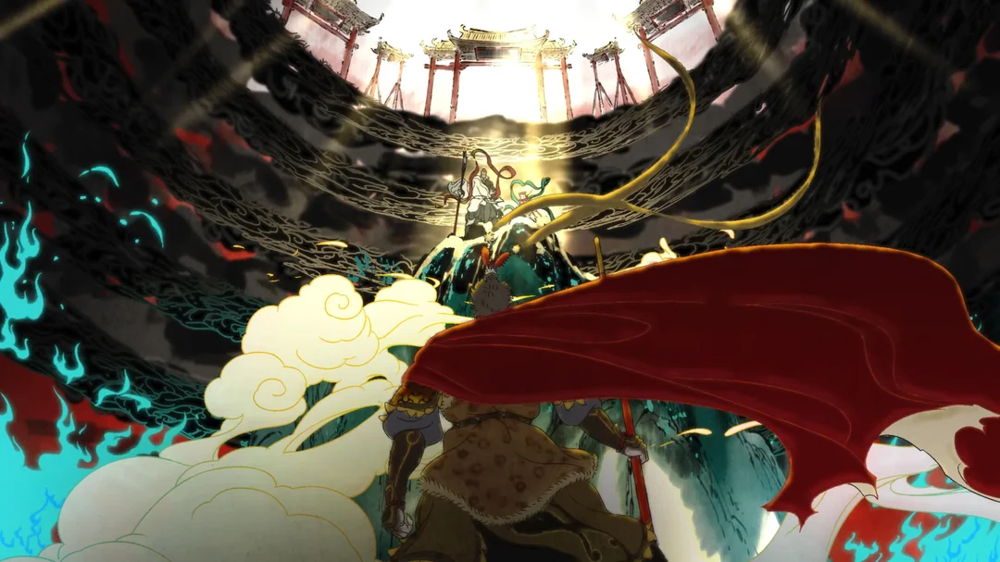

  

  
  
  
  
  

<picture>
  <source media="(prefers-color-scheme: dark)" srcset="https://cdn.jsdelivr.net/gh/wangzizhe/wangzizhe@output/github-snake-dark.svg" />
  <source media="(prefers-color-scheme: light)" srcset="https://cdn.jsdelivr.net/gh/wangzizhe/wangzizhe@output/github-snake.svg" />
  
</picture>

  <picture>
    <source media="(prefers-color-scheme: dark)" srcset="https://github-readme-streak-stats.herokuapp.com/?user=wangzizhe&theme=tokyonight&hide_border=true" />
    <source media="(prefers-color-scheme: light)" srcset="https://github-readme-streak-stats.herokuapp.com/?user=wangzizhe&theme=default&hide_border=true" />
    
  </picture>

  <picture>
    <source media="(prefers-color-scheme: dark)" srcset="https://github-readme-activity-graph.vercel.app/graph?username=wangzizhe&theme=github-dark&hide_border=true&hide_title=true" />
    <source media="(prefers-color-scheme: light)" srcset="https://github-readme-activity-graph.vercel.app/graph?username=wangzizhe&theme=github-light&hide_border=true&hide_title=true" />
    
  </picture>

  

    <picture>
      <source media="(prefers-color-scheme: dark)" srcset="./assets/labels/languages-dark.svg" />
      <source media="(prefers-color-scheme: light)" srcset="./assets/labels/languages-light.svg" />
      
    </picture>
  

  

  

    <picture>
      <source media="(prefers-color-scheme: dark)" srcset="./assets/labels/deep-learning-dark.svg" />
      <source media="(prefers-color-scheme: light)" srcset="./assets/labels/deep-learning-light.svg" />
      
    </picture>
  

  

  

    <picture>
      <source media="(prefers-color-scheme: dark)" srcset="./assets/labels/full-stack-dark.svg" />
      <source media="(prefers-color-scheme: light)" srcset="./assets/labels/full-stack-light.svg" />
      
    </picture>
  

  

  

    <picture>
      <source media="(prefers-color-scheme: dark)" srcset="./assets/labels/data-infra-dark.svg" />
      <source media="(prefers-color-scheme: light)" srcset="./assets/labels/data-infra-light.svg" />
      
    </picture>
  

  

