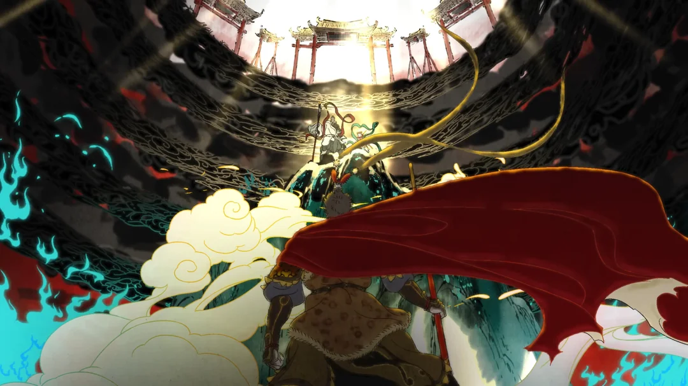
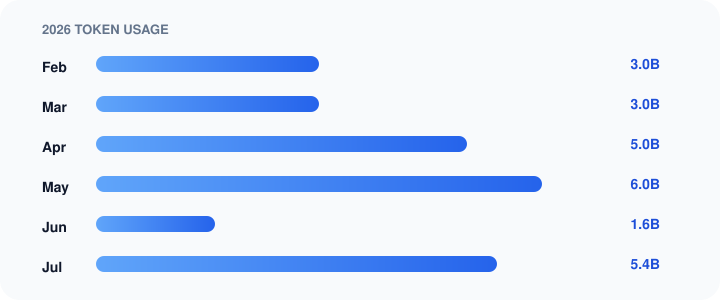

  <a href="https://youtu.be/2nGWcR4SY3E">https://youtu.be/2nGWcR4SY3E</a>
  

  
  
  
  
  

  <picture>
    <source media="(prefers-color-scheme: dark)" srcset="https://cdn.jsdelivr.net/gh/wangzizhe/wangzizhe@profile-3d/profile-night-rainbow.svg" />
    <source media="(prefers-color-scheme: light)" srcset="https://cdn.jsdelivr.net/gh/wangzizhe/wangzizhe@profile-3d/profile-green.svg" />
    
  </picture>

  

    <picture>
      <source media="(prefers-color-scheme: dark)" srcset="./assets/labels/monthly-tokens-dark.svg" />
      <source media="(prefers-color-scheme: light)" srcset="./assets/labels/monthly-tokens-light.svg" />
      
    </picture>
  

  

    <picture>
      <source media="(prefers-color-scheme: dark)" srcset="./assets/charts/monthly-tokens-dark.svg" />
      <source media="(prefers-color-scheme: light)" srcset="./assets/charts/monthly-tokens-light.svg" />
      
    </picture>
  

